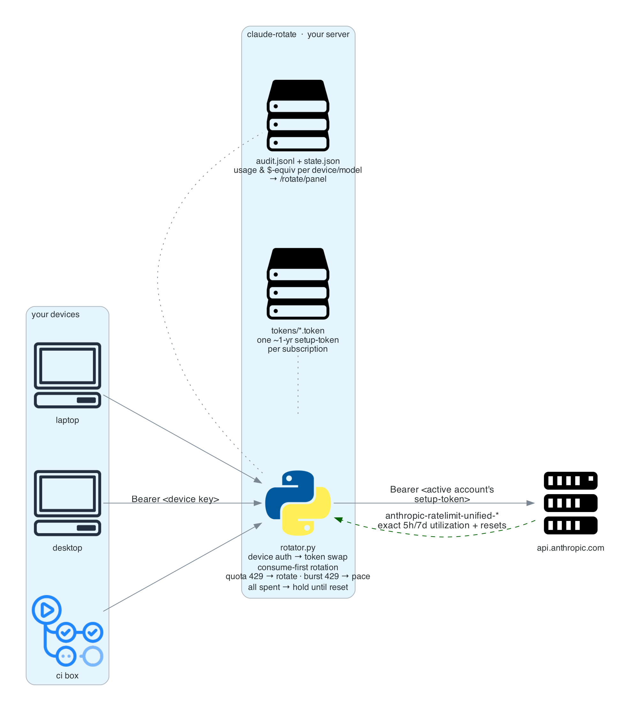
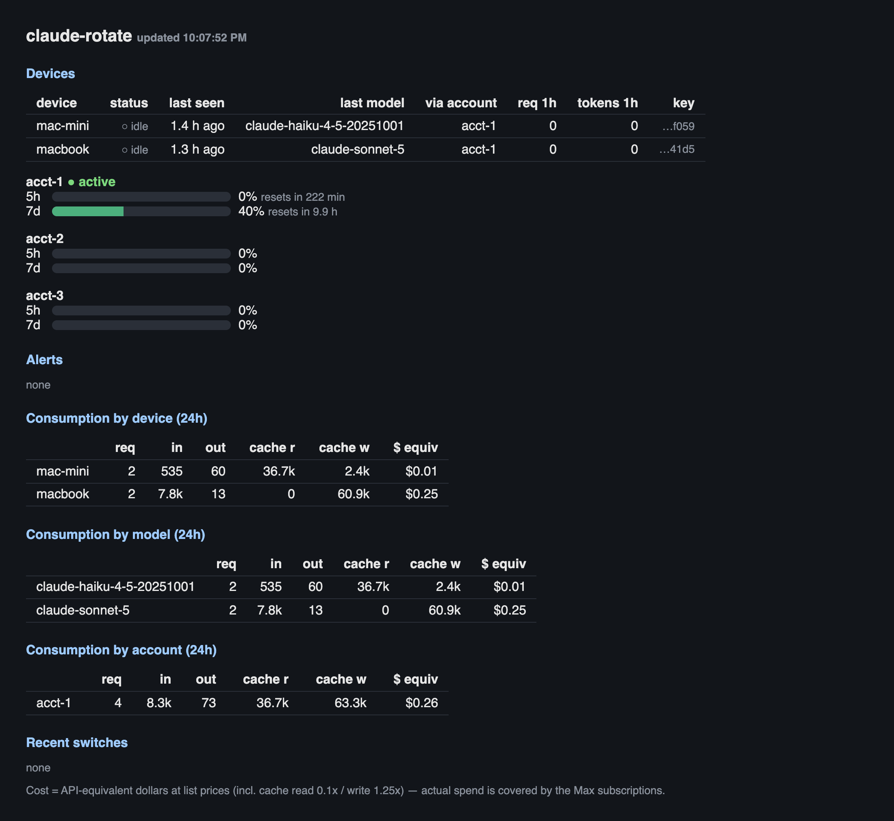
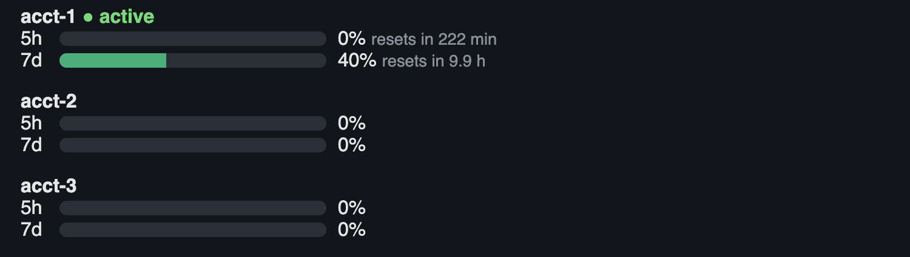

# claude-rotate


[](https://github.com/doxaras/claude-rotate/actions/workflows/tests.yml)


A tiny self-hosted proxy that lets **Claude Code** ride multiple Claude
Max/Pro subscriptions and switches accounts automatically when one hits its
rate-limit window — with a built-in analytics panel showing quota gauges,
per-device consumption, and cost-equivalent dollars.

One process, one config file, no database. Built for individual developers who
own more than one subscription and are tired of "You've hit your session
limit".

**Herd-safe, by test — not by vibes:** when your whole fleet slams into a rate
limit at the same instant, exactly *one* rotation happens — 100 in-flight
requests, 1 switch, 0 stampede. Reproducible numbers in
[Performance](#performance-herd-safe).

> **Terms-of-Service note.** This tool automates switching between accounts
> *you personally own and pay for*. Each account's limits are still fully
> enforced by Anthropic. Rotating accounts to work past limits is a gray area
> under Anthropic's consumer terms — use at your own risk, and do **not** use
> consumer subscriptions to back a shared/commercial service.

**Contents:**
[How it works](#how-it-works) ·
[Performance](#performance-herd-safe) ·
[Quickstart: server](#quickstart-server) ·
[Generating tokens](#generating-account-tokens-claude-setup-token) ·
[Quickstart: devices](#quickstart-each-device) ·
[Networking](#connecting-distributed-devices) ·
[Analytics panel](#analytics-panel) ·
[Configuration](#configuration-configjson) ·
[Run as a service](#run-as-a-service) ·
[Troubleshooting](#troubleshooting) ·
[Limitations](#limitations) ·
[Operations](#operations) ·
[Comparison](#comparison-with-similar-projects) ·
[Security](#security-notes) ·
[License](#license)

## How it works



Per request the proxy: authenticates the device (device key → device name),
swaps in the active account's long-lived setup-token, forwards transparently,
reads the exact `anthropic-ratelimit-unified-*` quota headers off the
response, applies the rotation policy (consume-first; quota 429 → rotate,
burst 429 → pace, all spent → hold), and logs usage per device/model.
Diagram regenerates with `python3 screenshots/architecture.py`
(needs `pip install diagrams` + graphviz).

Key insight: Claude Code respects `ANTHROPIC_BASE_URL`, and `claude
setup-token` mints a ~1-year OAuth token per account. The proxy holds those
tokens; devices only ever hold an internal *device key*. Every response from
Anthropic carries exact quota telemetry headers, so switching at 80% is
measured, not guessed.

## Performance (herd-safe)

The point of a *server* proxy is that a whole fleet leans on it at once — so
high-concurrency behavior is tested, not assumed. All numbers from the
reproducible stress suite (`python3 tests/test_stress.py`, mocked upstream,
Apple-silicon dev machine — run it on yours):

| Scenario | Result |
|---|---|
| 300 concurrent requests | every one served, audit complete, **~3,500 req/s** proxy overhead ceiling |
| Quota limit hit with **100 requests in flight** | **exactly 1 switch**, only 1 request ever touched the dead account, all 100 recovered |
| 50 burst-429s across 100 concurrent requests | **0 rotations** — paced on the same account, prompt caches kept warm |
| All accounts spent, 20 requests arrive | all park via hold-until-reset and release **together** at the window reset |
| 50 parallel SSE streams | byte-identical relay, usage audited on every stream |
| 50,000-row audit log | analytics rollup in **0.42 s** |

Why this matters with a fleet: the failure mode of naive rotators under load
is the stampede — N in-flight requests each trigger their own switch, the
account pool burns down in seconds, and every device's prompt cache is thrown
away N times. Here a single lock serializes the decision: one switch, everyone
else rides it.

Honest scope: single process by design (state lives in one place — don't run
uvicorn workers), and the upstream is mocked, so figures measure the proxy's
own overhead and race behavior, not Anthropic latency.

## Quickstart (server)

Requires Python 3.10+ and three packages: `fastapi`, `httpx`, `uvicorn`
(pinned in `requirements.txt`). Any always-on box works — a Mac mini, a
home-lab Linux machine, a small VPS.

```bash
git clone <this repo> && cd claude-rotate
pip install -r requirements.txt
./setup.sh                      # creates config.json, tokens/, logs/
./setup.sh add-account acct-1   # paste token from: claude setup-token  (account 1's browser)
./setup.sh add-account acct-2   # …account 2
./setup.sh add-device my-laptop # prints the env vars for that device
python3 rotator.py
```

## Generating account tokens (`claude setup-token`)

Each subscription account contributes one long-lived OAuth token. Facts below
are from the [official authentication docs](https://code.claude.com/docs/en/authentication.md)
unless flagged otherwise.

**Minting a token:**

```bash
claude setup-token
```

- Opens the same browser OAuth flow as `/login`; if no browser can reach the
  local callback (headless server, SSH session), it falls back to a paste-a-code
  flow — so you can mint tokens on the proxy server itself.
- Prints a token starting `sk-ant-oat01-…` to the terminal and does **not**
  save it anywhere — copy it straight into `./setup.sh add-account <name>`,
  which stores it under `tokens/` (chmod 600, gitignored).
- Valid for **about one year**. Requires a Claude subscription (Pro, Max,
  Team, or Enterprise).

**Minting for multiple accounts from one machine.** The account that completes
the browser OAuth is the account the token belongs to — the CLI's current
login doesn't decide it. (Officially undocumented; this is the behavior in
practice.) Two workable recipes:

1. **Browser profiles**: keep one browser profile (or incognito window) logged
   into claude.ai per account. Run `claude setup-token`, and complete the OAuth
   in the profile of the account you're minting for — copy the URL into that
   profile if the wrong one opens.
2. **Config-dir isolation**: `CLAUDE_CONFIG_DIR=~/.claude-acct2 claude
   setup-token` keeps a fully separate CLI login per directory, useful if you
   also want to *run* Claude Code as different accounts.

After adding an account, send one request through the proxy and check
`/rotate/status` — the unified utilization headers it reports are per-account,
so a token minted against the wrong account shows up immediately as the wrong
gauge moving.

**Lifetime & revocation:**

- There is currently **no CLI command to list or revoke** setup tokens
  ([open feature request](https://github.com/anthropics/claude-code/issues/57400));
  revoke manually from claude.ai settings. `/logout` only revokes the CLI's
  *active* session credential, not previously minted setup tokens.
- Treat each token file as a year-long bearer credential for that Anthropic
  account (see [Security notes](#security-notes)). When a token dies early, the
  proxy's upstream calls start returning 401 for that account — the roadmap has
  an alert for this.
- Scope note: subscription OAuth tokens are for Claude Code traffic — which is
  all this proxy forwards — and per the 2026 docs they are rejected by the raw
  Messages API.

## Quickstart (each device)

Two env vars in your shell profile — that's the whole client install:

```bash
export ANTHROPIC_BASE_URL=http://<server>:8484
export CLAUDE_CODE_OAUTH_TOKEN=<device key printed by add-device>
```

Run `claude` as usual. When account 1's 5-hour window fills, the next request
rides account 2. Use a VPN/overlay like Tailscale between devices and server —
the proxy speaks plain HTTP and device keys are bearer secrets. See
[Connecting distributed devices](#connecting-distributed-devices) for setups.

## Connecting distributed devices

The proxy is plain HTTP and device keys are bearer secrets, so the transport
between devices and server must be private. Pick one:

### Same LAN / subnet (nothing to install)

If every device lives on the same trusted network as the server — home lab,
office LAN — you don't need Tailscale or any overlay at all:

```bash
# on the server: find its LAN address
ipconfig getifaddr en0        # macOS (en0 = Ethernet/Wi-Fi)
hostname -I                   # Linux

# on each device:
export ANTHROPIC_BASE_URL=http://192.168.1.42:8484
```

- **macOS servers get a free stable name** via Bonjour/mDNS:
  `http://<hostname>.local:8484` (e.g. `http://mac-mini.local:8484`) works from
  Macs, iPhones, and most Linux devices (with `avahi-daemon`) — no IP to
  remember. Otherwise give the server a **DHCP reservation** in your router so
  its IP never changes under the devices pointing at it.
- Set `bind` in `config.json` to the LAN IP (or keep `0.0.0.0` if the box has
  only one network). Verify from a device: `curl http://<server>:8484/rotate/status?key=<device key>`.
- **Do not port-forward 8484 on your router.** LAN-only means the firewall
  boundary is your router's NAT; forwarding the port turns this into the
  internet-exposed scenario below.

The trust caveat: traffic is plain HTTP, so anyone on the same subnet can read
device keys off the wire. Fine for a home network you control; on a shared
office network or anywhere with guests, prefer one of the encrypted options
below. And a hybrid is normal — LAN for the desktop next to the server,
Tailscale for the laptop that leaves the house.

### Tailscale (recommended)

Zero-config WireGuard mesh; free tier covers personal use easily.

```bash
# on the server AND every device:
#   macOS:  brew install tailscale && brew services start tailscale
#   Linux:  curl -fsSL https://tailscale.com/install.sh | sh
tailscale up                      # login once per machine, same tailnet
tailscale status                  # note the server's name / 100.x.y.z address
```

With MagicDNS on (default on new tailnets), devices reach the server by name:

```bash
export ANTHROPIC_BASE_URL=http://<server-hostname>:8484   # e.g. http://my-server:8484
export CLAUDE_CODE_OAUTH_TOKEN=<device key>
```

Tighten the listener so the proxy is *only* reachable over the tailnet — set
`bind` in `config.json` to the server's Tailscale IP instead of `0.0.0.0`:

```json
{ "bind": "100.x.y.z", "port": 8484 }
```

Optional TLS: `tailscale serve --bg http://127.0.0.1:8484` publishes the proxy
as `https://<server>.<tailnet>.ts.net` (valid cert, tailnet-only). Then use
that URL as `ANTHROPIC_BASE_URL` and set `bind` to `127.0.0.1`.

CI runners and containers work too: ephemeral auth keys
(`tailscale up --auth-key=tskey-...`) join a runner to the tailnet for the
duration of a job; there's a ready-made GitHub Action (`tailscale/github-action`).

### Plain WireGuard

Same effect, no third party. Sketch: generate a keypair per machine
(`wg genkey | tee private.key | wg pubkey > public.key`), give the server a
`wg0` with an internal subnet (e.g. `10.84.0.1/24`), add each device as a
`[Peer]` with `AllowedIPs = 10.84.0.X/32`, and point devices at
`http://10.84.0.1:8484`. Set `bind` to `10.84.0.1`. More manual than
Tailscale (key distribution, NAT traversal is on you), but fully self-hosted.

### SSH tunnel (zero install)

Any device that can SSH to the server needs nothing else:

```bash
ssh -N -L 8484:127.0.0.1:8484 user@server &
export ANTHROPIC_BASE_URL=http://127.0.0.1:8484
```

With `bind: 127.0.0.1` on the server, this is the tightest setup — the proxy
never listens on a network interface at all. Use `autossh` (or
`ServerAliveInterval 30` in `~/.ssh/config`) to keep the tunnel up; fine for a
laptop or a single CI box, tedious beyond a few devices.

### Cloudflare Tunnel (device without VPN access)

For a device that can't join your tailnet (locked-down corp machine, hosted
CI you can't install agents on), `cloudflared` can expose the proxy through
Cloudflare without opening ports:

```bash
# server:
cloudflared tunnel login
cloudflared tunnel create claude-rotate
cloudflared tunnel route dns claude-rotate rotate.example.com
cloudflared tunnel run --url http://127.0.0.1:8484 claude-rotate
# device:
export ANTHROPIC_BASE_URL=https://rotate.example.com
```

**This makes the proxy internet-reachable** — the only thing between the
world and your Anthropic tokens is the device-key check. If you go this
route, put [Cloudflare Access](https://developers.cloudflare.com/cloudflare-one/)
(a Zero Trust service-token policy) in front so unauthenticated requests never
reach the proxy, and treat device keys as revocable: delete a leaked one from
`config.json` and restart. Prefer any of the VPN options above when possible.

### Other overlays

ZeroTier and NetBird work identically to Tailscale for this purpose (private
overlay IP + `bind` to it); use whichever your fleet already runs. Whatever
the transport, the checklist is the same: proxy bound to a private interface,
HTTP never exposed publicly, one device key per machine so any single machine
can be revoked alone.

## Analytics panel

Open `http://<server>:8484/rotate/panel?key=<any device key>`:



Live 5-hour and weekly gauges per account, straight from Anthropic's own
rate-limit headers:



- **Devices** — every registered device: online status, last seen, last model,
  which account its traffic rode, requests + tokens in the last hour.
- **Accounts** — live 5-hour and weekly utilization gauges (from Anthropic's
  own headers), active account, reset countdowns.
- **Alerts** — device over N tokens/hour, expensive-model usage (Opus/Fable),
  account near the switch threshold. Thresholds in `config.json`.
- **Consumption (24h)** — by device / model / account, with a *cost-equivalent*
  column: what the usage would cost at API list prices (incl. cache read 0.1× /
  write 1.25×) — i.e. what the subscriptions are saving you.

JSON endpoints: `/rotate/status` (accounts + switch events) and
`/rotate/stats` (rollups + alerts), same `?key=` or `Authorization: Bearer`
auth. Audit trail: `logs/audit.jsonl`, one JSON record per request.

## OpenAI-compatible endpoint

`POST /v1/chat/completions` (same device-key auth) accepts OpenAI-format chat
requests — streaming included — and rides the same rotated accounts, so any
OpenAI-format app or LLM router can use the capacity, not just Claude Code:

```bash
curl http://<server>:8484/v1/chat/completions \
  -H "Authorization: Bearer <device key>" -H "content-type: application/json" \
  -d '{"model":"claude-sonnet-5","max_tokens":256,
       "messages":[{"role":"user","content":"hello"}]}'
```

Text conversations only (tool use → 400). When every account's window is spent
it returns `503` + `Retry-After: <seconds to earliest reset>` — point a
router's circuit breaker at that. Responses carry `x-rotate-account` and the
upstream `anthropic-ratelimit-unified-*` headers for per-request telemetry.

## Configuration (`config.json`)

| Field | Meaning |
|---|---|
| `accounts[]` | `{name, token_file}` — one `claude setup-token` per subscription, stored under `tokens/` (chmod 600) |
| `devices{}` | `name → device key`; key is what the device puts in `CLAUDE_CODE_OAUTH_TOKEN` |
| `accounts[].priority` | lower = preferred; accounts form tiers, backup tiers only used when every preferred account is spent (default 100) |
| `accounts[].disabled` | `true` benches an account: never rotated onto, still shown in the panel |
| `switch_threshold` | 5h-window utilization that triggers rotation (default 0.8) |
| `switch_threshold_7d` | weekly-window utilization that makes an account unusable (default 0.98) |
| `strategy` | `consume-first` (default) or `least-used` — see below |
| `switch_cooldown_s` | min seconds between voluntary switches (default 300); hard limits ignore it |
| `switch_margin` | hysteresis: a threshold switch needs a candidate this much better (default 0.05) |
| `consume_first_margin_s` | proactive switch only if the candidate's weekly reset is this much sooner (default 3600) |
| `hold_max_s` | when *every* account is spent, hold the request open up to this long waiting for a window reset instead of returning 429 (default 0 = off) |
| `prices_per_mtok` | substring-matched `[input, output]` $ per MTok for the cost columns |
| `alerts` | `device_tokens_per_hour`, `expensive_model_patterns`, `util_warn` |

### Rotation policy

An account is *usable* while its 5h window is under `switch_threshold` and its
weekly window under `switch_threshold_7d`; a window past its reset counts as
0%. State survives restarts in `state.json`.

- **`consume-first`** (default): burn the usable account whose **weekly window
  resets soonest** — weekly quota is use-it-or-lose-it, so the perishable
  account is spent first and no paid quota expires unused. The proxy also
  switches *proactively* (below the threshold) when another usable account's
  weekly reset is at least `consume_first_margin_s` sooner.
- **`least-used`**: classic — lowest 5h utilization wins.
- A cooldown plus a hysteresis margin stop accounts ping-ponging at the
  threshold; a hard limit (quota actually rejected) always switches
  immediately.
- **Burst vs quota 429s**: a per-minute rate-limit 429 (utilization not
  exhausted) does *not* rotate — rotating would move the burst to the next
  account and throw away its warm prompt cache. The account is paced for
  `retry-after` seconds and the request retried.
- **Hold-until-reset** (`hold_max_s` > 0): when every account is spent, the
  proxy keeps the request open and retries after the soonest 5h reset instead
  of failing — an unattended CI/agent run finishes on its own instead of dying
  at 2am. Make sure your client's request timeout tolerates the wait (Claude
  Code's default is generous; other clients may need tuning).

### Preferring one account over another

Three levels of control, from lazy to pro — all in the same `config.json`,
deliberately **no separate rules file** (see design note below):

**Level 0 — do nothing.** The defaults (consume-first + thresholds + cooldown)
already make a sane global decision. Most single-owner setups need nothing else.

**Level 1 — priority tiers.** Give accounts a `priority` (lower = preferred):

```json
"accounts": [
  { "name": "max-20x",  "token_file": "tokens/max-20x.token",  "priority": 1 },
  { "name": "max-5x",   "token_file": "tokens/max-5x.token",   "priority": 1 },
  { "name": "old-pro",  "token_file": "tokens/old-pro.token",  "priority": 2 }
]
```

Rotation happens *within* the lowest-numbered tier that still has a usable
account; `old-pro` above is touched only when both Max accounts are spent.
When a preferred account's window resets, traffic is pulled back automatically
(`priority_recovery` in the events feed) after the cooldown — the backup is a
spillway, not a new home. Accounts without a `priority` share one default tier,
which is why Level 0 works unchanged.

**Level 2 — bench an account.** `"disabled": true` takes an account out of
rotation entirely (a work account you don't want touched, one you're resting)
while keeping it visible in the panel. If the *active* account is disabled in
config, the proxy abandons it on the next response, cooldown or not. Re-enable
by deleting the flag; both changes need a restart (hot reload is on the roadmap).

Combine with `strategy` for the remaining temperament choice: `consume-first`
(spend perishable weekly quota first) or `least-used` (spread evenly).

**Design note — why no rules YAML:** a rules engine (per-model routes,
time-of-day windows, per-device pinning) would add a parser, a second config
file, and an ordering semantics to a one-file tool, and every use case we've
actually hit decomposes into the four knobs above (strategy, priority,
disabled, thresholds). If a real need appears that doesn't decompose — say
per-device account pinning — add it as another plain field on the existing
config objects, not as a DSL.

## Run as a service

- **macOS**: `deploy/com.example.claude-rotate.plist` (read its comments —
  launchd needs the full python3 path and a local-disk install).
- **Linux**: `deploy/claude-rotate.service` (systemd).

## Troubleshooting

**Client gets 401 with `claude-rotate: unknown device key`.** The proxy is
rejecting the *device* (the error body names claude-rotate, so it's not
Anthropic). The device's `CLAUDE_CODE_OAUTH_TOKEN` doesn't match any entry in
`config.json` `devices{}` — re-check the key, or re-run
`./setup.sh add-device` and restart.

**Client gets a 401 whose error body comes from Anthropic.** The *account
token* the proxy swapped in was rejected upstream — on a previously working
account this almost always means the setup token died (revoked, or hit its
~1-year expiry). Re-mint with `claude setup-token`, replace
`tokens/<name>.token`, restart.

**A request seems to hang.** If every account is spent and `hold_max_s` is
set, that's hold-until-reset doing its job — the request is parked until the
soonest 5h window reset. Check `recent_events` in `/rotate/status` for a
`hold` entry. Set `hold_max_s: 0` if you'd rather fail fast.

**"Why did it switch accounts?"** Every switch is an event in
`/rotate/status` → `recent_events` (and the panel's *Recent switches*), with a
reason: `quota_exhausted`, `utilization>=<threshold>`, `consume_first`,
`priority_recovery`, or `account_disabled`. If you saw a 429 upstream but *no*
switch, it was a per-minute burst — the proxy paced the same account on
purpose (see [Rotation policy](#rotation-policy)).

**Config edits don't take effect.** Config is read once at startup. Restart:
`launchctl kickstart -k gui/$(id -u)/<label>` (macOS) or
`systemctl restart claude-rotate` (Linux). Hot reload is on the roadmap.

**Does the VS Code extension work?** Yes — it honours the same
`ANTHROPIC_BASE_URL` / `CLAUDE_CODE_OAUTH_TOKEN` environment variables. Launch
VS Code from a shell that has them exported (or set them user-wide) so the
extension inherits them.

**Panel is empty or unauthorized.** The panel needs
`?key=<any device key>` in the URL; consumption tables build from
`logs/audit.jsonl` and only show the last 24h, so a fresh install shows
zeros until traffic flows.

**Client throws Zlib/Brotli decoding errors.** Shouldn't happen — the proxy
forces `accept-encoding: identity` upstream and strips `content-encoding`
from responses. If it appears after modifying `rotator.py`, you broke
load-bearing fact #2 in the continuation notes.

## Limitations

Stated plainly, in the same spirit as the [comparison](#comparison-with-similar-projects):

- **One active account, globally.** Every device rides the same account at any
  moment, so a token-hungry CI box drains the window your laptop is using.
  Per-device *visibility* exists (panel, alerts); per-device *quotas* don't.
- **No per-model weekly caps.** Anthropic tracks some model families
  separately; the proxy only tracks the account-wide 5h/7d windows, so an
  account out of (say) Opus quota gets benched entirely even if Sonnet still
  has room. teamclaude does this better today.
- **Switches drop warm prompt caches.** After a rotation, every device's first
  request re-writes its prompt cache on the new account — that's the cost that
  burst-pacing (and the hysteresis margin) exist to avoid paying needlessly.
- **Restart to reconfigure.** No hot reload yet.
- **Plain HTTP by design.** Transport privacy is delegated to the network
  layer — see [Connecting distributed devices](#connecting-distributed-devices).
- **Built on undocumented headers.** Quota telemetry comes from
  `anthropic-ratelimit-unified-*`; if Anthropic changes them, rotation
  degrades to reacting to 429s until the code is updated.
- **No automatic token renewal.** Setup tokens last ~1 year and die silently;
  the symptom is upstream 401s (see Troubleshooting).

## Operations

- **Audit log growth.** `logs/audit.jsonl` grows without bound (one JSON line
  per request) and the stats endpoint re-reads it fully on every refresh, so
  after months it slows the panel. The panel only uses the last 24h — rotate
  the file whenever you like:

  ```bash
  # e.g. monthly via cron/launchd; the proxy recreates the file on the next request
  mv logs/audit.jsonl "logs/audit-$(date +%Y%m).jsonl"
  ```

  No restart needed (the file is opened per write). In-process rotation is on
  the roadmap.
- **What to back up.** `tokens/` and `config.json` — that's the whole
  identity of the install. `state.json` is disposable (quota state is
  re-learned from the first responses; you only lose the events history), and
  `logs/` is disposable analytics.
- **Upgrades.** `git pull`, run `python3 tests/run_all.py`, restart the
  service, then eyeball `/rotate/panel` — active account, gauges, and a
  request flowing end-to-end.
- **Health check.** `curl -fs http://<server>:8484/rotate/status?key=<device key>`
  exits non-zero when the proxy is down — wire it into uptime monitoring if
  the fleet depends on it. The launchd/systemd units in `deploy/` already
  restart the process if it dies.

## Comparison with similar projects

The multi-account rotation niche is well populated. Stars as of Sep 2026.

| Project | ⭐ | Type | Auto-rotate | Exact quota telemetry | Multi-device | Dashboard | ToS risk |
|---|---|---|---|---|---|---|---|
| **claude-rotate** (this) | — | server proxy | ✓ consume-first, burst pacing, hold — [herd-safe under load](#performance-herd-safe) | ✓ unified headers | ✓ device keys, per-device analytics | ✓ web panel + $-equivalent | ⚠️ gray |
| [teamclaude](https://github.com/KarpelesLab/teamclaude) | 283 | local proxy | ✓ quota-based, per-model caps, burst pacing | ✓ unified headers | ✗ (one user's machine) | ✓ TUI | ⚠️ gray |
| [claude-swap](https://github.com/realiti4/claude-swap) | 2.2k | credential switcher | ✓ threshold + consume-first | ✓ polls usage | ✗ per-machine | ✓ CLI/TUI + menu bar | ⚠️ gray |
| [claude-relay-service](https://github.com/Wei-Shaw/claude-relay-service) | 12.6k | relay platform | ✓ account pool | partial | ✓ per-key clients | ✓ full admin UI | ❌ built for account sharing |
| [CC-Router](https://github.com/VictorMinemu/CC-Router) | 28 | local proxy | round-robin only | ✗ | ✗ | ✗ | ⚠️ gray |
| [claude-account-switcher](https://github.com/Symbioose/claude-account-switcher) | 53 | menu-bar switcher | ✓ at limits | ✓ live usage | ✗ macOS local | menu bar | ⚠️ gray / ✓ manual |
| [ccrotate](https://github.com/somersby10ml/ccrotate), [claude-rotator](https://github.com/jtxmp/claude-rotator), [cc-relay-proxy](https://github.com/in-jun/cc-relay-proxy) | ≤7 | small CLIs/proxies | basic | ✗ | ✗ | ✗ | ⚠️ gray |

**Honest reviews:**

- **teamclaude** — the most sophisticated rotation engine in the field:
  per-model weekly caps, burst-vs-quota 429 discrimination, post-failover
  pacing, OAuth refresh, a MITM catch for hardcoded endpoints, zero npm
  dependencies. claude-rotate adopted its burst-pacing and hold-until-reset
  ideas. If you're one person on one machine, it's arguably the better tool;
  it has no multi-device story.
- **claude-swap** — the most popular and most polished UX (uv/pipx install,
  hysteresis, quarantine of dead tokens, parallel sessions per terminal).
  It swaps local credentials rather than proxying, so there's no
  fleet/CI story and each machine manages its own accounts. Its
  `consume-first` strategy is where we took the name and idea from.
- **claude-relay-service** — by far the biggest (Redis, admin UI, multi-provider:
  Claude/OpenAI/Gemini). It is explicitly built for **拼车 / carpooling** —
  pooling subscription accounts across multiple people to split costs. That is
  not a gray area: sharing consumer subscription access with third parties
  violates Anthropic's consumer terms, and account bans around such services
  are regularly reported. Impressive engineering; don't use it with consumer
  Max/Pro accounts.
- **CC-Router** — clean and simple, but blind round-robin: no telemetry, so it
  can rotate onto a spent account and drops warm prompt caches for no reason.
- **claude-account-switcher** (and the Alfred/menu-bar family) — solves login
  juggling, not routing. Manual switching between your own accounts is the
  most ToS-defensible workflow of all; the auto-switch-at-limit mode shares
  the same gray area as everything else here.
- **claude-rotate** — what we actually add over the field: the **multi-device
  server model** (devices hold revocable device keys, year-long account tokens
  never leave the server), **per-device consumption/cost attribution**, and a
  **published concurrency story** — the [stress suite](#performance-herd-safe)
  proves one-switch-per-herd and no-rotation burst storms under 100+ in-flight
  requests, numbers you can re-run rather than take on faith. (teamclaude
  engineered for herd failover too — its post-switch pacing — but doesn't
  publish load measurements.) What others do better: teamclaude's per-model
  caps and OAuth refresh, claude-swap's install/UX polish. One file, no
  database, by design.

**On ToS, plainly:** every tool above that *automatically* rotates consumer
subscriptions to continue past a rate limit — including claude-rotate — sits
in the same gray area described in the note at the top of this README: you're
automating around limits Anthropic set per account, using accounts you
personally own and pay for. Anthropic's consumer terms prohibit sharing
account credentials and reselling access; they are less explicit about one
person owning several subscriptions. The bright line: **rotating your own
accounts = gray, at your own risk; pooling/sharing/reselling access
(claude-relay-service's core use case) = violation.** If your workload is
commercial or shared, use the API with metered billing instead.

## Security notes

- `tokens/*.token` are year-long bearer credentials for your Anthropic
  accounts. They stay on the server, mode 600, and are gitignored along with
  `config.json`, `state.json`, and `logs/`.
- Device keys authenticate devices to the proxy only; revoke one by deleting
  its entry in `config.json` and restarting.
- Don't expose port 8484 to the public internet; bind to a tailnet/LAN
  interface or keep `bind: 0.0.0.0` behind a firewall.

---

## For the next agent (continuation notes)

Everything lives in **`rotator.py` (~450 lines, FastAPI)** — read it top to
bottom before changing anything. `phase0_proxy.py` is a standalone logging
passthrough kept for debugging header behavior; not part of the service.

Load-bearing implementation facts (each was verified empirically — keep them):

1. **Transparent passthrough.** The proxy forwards all paths/methods to
   `api.anthropic.com`, replacing only the `Authorization` header. Claude Code
   sends its own `anthropic-beta: oauth-2025-04-20` etc. — do not strip or
   reorder client headers.
2. **Encoding trick.** Forwarded requests force `accept-encoding: identity`
   and the response's `content-encoding` header is dropped — otherwise httpx
   auto-decompresses while the original header survives and the client throws
   Zlib/Brotli errors.
3. **Quota telemetry** comes from `anthropic-ratelimit-unified-5h-utilization`
   / `-7d-utilization` / `-5h-reset` / `-status` response headers (present on
   Max subscription traffic; undocumented — re-verify after Anthropic API
   changes).
4. **SSE usage capture** parses `data:` lines containing `"usage"` while
   streaming chunks through untouched; audit is written in the stream's
   `finally`.

Roadmap, in intended order:

- [x] **Tests.** `python3 tests/run_all.py` — 101 offline checks, no network
      (needs a valid `config.json` to import the module):
      `test_rotator.py` switch logic (consume-first ordering, burst-vs-quota
      429, cooldown, hysteresis, hold/exhausted verdicts, window-reset
      recovery); `test_analytics.py` SSE usage capture, pricing/cost math,
      `aggregate_audit` rollups/alerts/roster; `test_proxy.py` end-to-end HTTP
      through the real ASGI app against a mocked upstream (auth, header
      rewriting incl. the encoding trick, SSE relay, transparent quota-429
      rotate+retry, burst pacing, 429 passthrough vs hold-until-reset, admin
      endpoints); `test_stress.py` high-traffic behavior (300-request
      fan-out with throughput floor, exactly-one-switch race check with 100
      in-flight requests during a quota hit, burst storm without rotation,
      20 concurrent held requests, 50 parallel SSE streams, events-list
      bound under churn, aggregate_audit speed on a 50k-row log).
- [x] **OpenAI-compatible endpoint.** `POST /v1/chat/completions` (see its
      section above): OpenAI ↔ Anthropic translation incl. SSE chunks, in
      `oai_compat.py` (pure, tested offline in `tests/test_oai_compat.py`);
      injects `anthropic-version` + `anthropic-beta: oauth-2025-04-20`,
      forwards NO client headers, refuses tool use with a 400. The rotation
      loop is shared with the transparent proxy (`send_upstream`).
- [x] **Exhaustion signal.** The OpenAI endpoint returns 503 +
      `Retry-After: <earliest reset>` when all accounts are spent (after any
      `hold_max_s` hold is exhausted) — point a router's breaker at it. The
      transparent proxy deliberately still passes Anthropic's 429 through:
      Claude Code handles those natively, and that path's contract is
      transparency.
- [ ] **Webhook alerts** (Slack/Teams/generic POST) firing on the same rules
      as the panel's alerts section.
- [ ] **In-process audit rotation** — roll `logs/audit.jsonl` past a size/age
      threshold so the Operations section's cron recipe becomes unnecessary,
      and stop re-reading the whole file per stats call (seek from the tail).
- [ ] **Dockerfile** (+ compose example) — also enables running as a sidecar
      next to a router in k8s; tokens mounted as secrets.
- [ ] **Hot config reload** (`SIGHUP` or mtime check) so `add-account` /
      `add-device` don't need a restart.
- [ ] **Token renewal automation** — setup-tokens last ~1 year; at minimum
      alert on auth failures (401 from upstream on a known-good account
      usually means the token died).

Style: keep it one file until it genuinely hurts; stdlib + fastapi/httpx only;
every new claim about Anthropic behavior gets verified against the live API
before being relied on (the `phase0_proxy.py` harness exists for exactly
that).

## License

[MIT](LICENSE) © 2026 John Doxaras. The Terms-of-Service note at the top of
this README is part of the deal: this software is for rotating accounts *you*
own and pay for, at your own risk.
